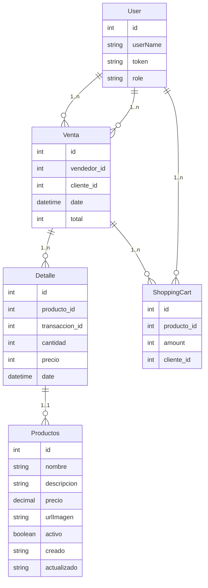

# REST Test

# Bienvenidos!

La prueba consiste en agregar nueva funcionalidad a la API REST que corre en este repositorio. Para eso vamos a guiarnos por los siguientes puntos:

1) Hacer un fork del repositorio, crear un nuevo branch y realizar las tareas enunciadas a continuación. (completada)

2) Proveer servicios para la administración de la compra de productos. Los mismos deberán incluir: (completada)
- ABM de productos. 
- ABM de clientes.
- Consulta de transacciones de compra.
- Aprobación de compras.
 
3) Los servicios deben contar con logs que indiquen si el servicio respondió y proceso correctamente o no. (completada)
  
4) Documentar brevemente los servicios implementados. (completada)

## Documentación de Servicios del Proyecto de Compra y Venta

### Diagramas que llevaron a la creacion de los servicios

#### Diagramas de Base de Datos

#### Diagramas Casos de Usos 
(.src/main/resources/images/Captura de pantalla 2024-04-06 161628.png)

### UserService
Este servicio proporciona operaciones relacionadas con la gestión de usuarios en el sistema.

#### Métodos:
1) getByUserName(String userName): Optional<User>
    - Descripción: Recupera un usuario por su nombre de usuario.
    - Parámetros:
      - userName (String): El nombre de usuario del usuario a recuperar.
    - Retorna: Un objeto Optional que puede contener un usuario si se encuentra, de lo contrario, estará vacío.

2) getById(String userId): Optional<User>
    - Descripción: Recupera un usuario por su ID.
    - Parámetros:
      - userId (String): El ID del usuario a recuperar.
    - Retorna: Un objeto Optional que puede contener un usuario si se encuentra, de lo contrario, estará vacío.

3) getByToken(String token): Optional<User>
    - Descripción: Recupera un usuario por su token de acceso.
    - Parámetros:
      - token (String): El token de acceso del usuario a recuperar.
    - Retorna: Un objeto Optional que puede contener un usuario si se encuentra, de lo contrario, estará vacío.

4) existByUserName(String userName): boolean
    - Descripción: Verifica si un usuario existe por su nombre de usuario.
    - Parámetros:
      - userName (String): El nombre de usuario a verificar.
    - Retorna: true si el usuario existe, de lo contrario, false.

5) save(User user): User
    - Descripción: Guarda un nuevo usuario en el sistema o actualiza uno existente.
    - Parámetros:
      - user (User): El usuario a guardar o actualizar.
    - Retorna: El usuario guardado o actualizado.

6) delete(User user): void
    - Descripción: Elimina un usuario del sistema.
    - Parámetros:
      - user (User): El usuario a eliminar.
    - Retorna: No hay retorno.

### ProductService
Este servicio proporciona operaciones relacionadas con la gestión de productos en el sistema.

#### Métodos:
1) add(Product product): Product
    - Descripción: Agrega un nuevo producto al sistema.
    - Parámetros:
      - product (Product): El producto a agregar.
    - Retorna: El producto agregado.

2) findAll(): List<Product>
    - Descripción: Recupera todos los productos en el sistema.
    - Parámetros: No hay parámetros.
    - Retorna: Una lista de todos los productos.

3) findById(Long id): Product
    - Descripción: Recupera un producto por su ID.
    - Parámetros:
      - id (Long): El ID del producto a recuperar.
    - Retorna: El producto recuperado si se encuentra, de lo contrario, lanza una excepción.

4) deleteById(Long id): Boolean
    - Descripción: Elimina un producto por su ID.
    - Parámetros:
      - id (Long): El ID del producto a eliminar.
    - Retorna: true si el producto se elimina con éxito, de lo contrario, false.

5) update(Product newProduct, Long id): Product
    - Descripción: Actualiza un producto existente en el sistema.
    - Parámetros:
      - newProduct (Product): El nuevo objeto de producto con los datos actualizados.
      - id (Long): El ID del producto a actualizar.
    - Retorna: El producto actualizado.

### ShoppingCartService
Este servicio proporciona operaciones relacionadas con la gestión de carritos de compra en el sistema.

#### Métodos:
1) getListByClient(String clientId): List<ShoppingCart>
    - Descripción: Recupera todos los elementos del carrito de compra para un cliente dado.
    - Parámetros:
      - clientId (String): El ID del cliente para el que se recuperan los elementos del carrito.
    - Retorna: Una lista de elementos del carrito de compra para el cliente especificado.

2) cleanShoppingCart(String clientId): void
    - Descripción: Elimina todos los elementos del carrito de compra para un cliente dado.
    - Parámetros:
      - clientId (String): El ID del cliente para el que se limpia el carrito de compra.
    - Retorna: No hay retorno.

3) updateProduct(ShoppingCart shoppingCartOld, Product product, Integer amount, User user): void
    - Descripción: Actualiza la cantidad de un producto en el carrito de compra de un cliente.
    - Parámetros:
      - shoppingCartOld (ShoppingCart): El elemento del carrito de compra existente.
      - product (Product): El producto a actualizar o agregar en el carrito de compra.
      - amount (Integer): La cantidad de productos a actualizar o agregar.
      - user (User): El usuario que posee el carrito de compra.
    - Retorna: No hay retorno.

4) addProduct(Product product, Integer amount, User user): ShoppingCart
    - Descripción: Agrega un producto al carrito de compra de un cliente.
    - Parámetros:
      - product (Product): El producto a agregar al carrito de compra.
      - amount (Integer): La cantidad de productos a agregar.
      - user (User): El usuario que posee el carrito de compra.
    - Retorna: El elemento del carrito de compra agregado.

5) getCountByClient(String clientId): Long
    - Descripción: Obtiene el número total de elementos en el carrito de compra para un cliente dado.
    - Parámetros:
      - clientId (String): El ID del cliente para el que se obtiene el recuento de elementos del carrito.
    - Retorna: El número total de elementos en el carrito de compra para el cliente especificado.

6) update(String id, ShoppingCart shoppingCart): void
    - Descripción: Actualiza un elemento del carrito de compra en el sistema.
    - Parámetros:
      - id (String): El ID del elemento del carrito de compra a actualizar.
      - shoppingCart (ShoppingCart): El elemento del carrito de compra con los datos actualizados.
    - Retorna: No hay retorno.

7) delete(String id): void
    - Descripción: Elimina un elemento del carrito de compra del sistema.
    - Parámetros:
      - id (String): El ID del elemento del carrito de compra a eliminar.
    - Retorna: No hay retorno.

8) getByClientAndProduct(String clientId, Long productId): ShoppingCart
    - Descripción: Recupera un elemento del carrito de compra para un cliente y un producto dados.
    - Parámetros:
      - clientId (String): El ID del cliente.
      - productId (Long): El ID del producto.
    - Retorna: El elemento del carrito de compra si se encuentra, de lo contrario, null.

### SaleService
Este servicio proporciona operaciones relacionadas con la gestión de ventas en el sistema.

#### Métodos:
1) getSalesAll(): List<Sale>
    - Descripción: Recupera todas las ventas en el sistema.
    - Parámetros: No hay parámetros.
    - Retorna: Una lista de todas las ventas.

2) getSalesByClient(String clientId): List<Sale>
    - Descripción: Recupera todas las ventas realizadas por un cliente dado.
    - Parámetros:
      - clientId (String): El ID del cliente para el que se recuperan las ventas.
    - Retorna: Una lista de ventas realizadas por el cliente especificado.

3) findByDateBetween(LocalDateTime fechaInicio, LocalDateTime fechaFin): List<Sale>
    - Descripción: Recupera las ventas realizadas dentro de un rango de fechas dado.
    - Parámetros:
      - fechaInicio (LocalDateTime): La fecha de inicio del rango.
      - fechaFin (LocalDateTime): La fecha de fin del rango.
    - Retorna: Una lista de ventas realizadas dentro del rango de fechas especificado.

4) createSale(String sellerId, String clientId): void
    - Descripción: Crea una nueva venta en el sistema basada en los productos en el carrito de compra del cliente.
    - Parámetros:
      - sellerId (String): El ID del vendedor que realiza la venta.
      - clientId (String): El ID del cliente que realiza la compra.
    - Retorna: No hay retorno.

5) getSalesBySeller(String sellerId): List<Sale>
    - Descripción: Recupera todas las ventas realizadas por un vendedor dado.
    - Parámetros:
      - sellerId (String): El ID del vendedor para el que se recuperan las ventas.
    - Retorna: Una lista de ventas realizadas por el vendedor especificado.

### DetailService
Este servicio proporciona operaciones relacionadas con los detalles de ventas en el sistema.

#### Métodos:
1) getDetailsAll(): List<Detail>
    - Descripción: Recupera todos los detalles de ventas en el sistema.
    - Parámetros: No hay parámetros.
    - Retorna: Una lista de todos los detalles de ventas.

2) createDetail(Detail detail): void
    - Descripción: Crea un nuevo detalle de venta en el sistema.
    - Parámetros:
      - detail (Detail): El detalle de venta a crear.
    - Retorna: No hay retorno.

3) getDetailBySale(String saleId): List<Detail>
    - Descripción: Recupera todos los detalles de venta para una venta específica.
    - Parámetros:
      - saleId (String): El ID de la venta para la que se recuperan los detalles.
    - Retorna: Una lista de detalles de venta para la venta especificada.

4) findByDateBetween(LocalDateTime fechaInicio, LocalDateTime fechaFin): List<Detail>
    - Descripción: Recupera los detalles de venta realizados dentro de un rango de fechas dado.
    - Parámetros:
      - fechaInicio (LocalDateTime): La fecha de inicio del rango.
      - fechaFin (LocalDateTime): La fecha de fin del rango.
    - Retorna: Una lista de detalles de venta realizados dentro del rango de fechas especificado.

 
5) Todos los servicios deben contar, al menos, con test unitarios. (completada)
 
6) Enviar un Pull Request con todos los cambios realizados. (completada)

Para correr la aplicación se puede utilizar maven: 

mvn spring-boot:run -Drun.jvmArguments="-Dspring.profiles.active=local"

Pueden probar el servicio echo con un curl de la siguiente forma:

`curl -X POST -H 'Content-Type: application/json' -H 'Accept: application/json' -d '{"message":"mensaje de prueba"}' localhost:8080/payments/echo`

Bonus

1) ABM de vendedores. (completada)
2) Agregar test de integración. (completada) (se encuentran en la carpeta controller, son de integracion por que no testean los metodos deforma directa sino mediante cunsultas http)
3) Calcular la cobertura de los tests. (completada) (se encuentra en la carpeta target/site/jacoco/index.html)

Aquí puedes encontrar el [informe de cobertura de los tests](./target/site/jacoco/index.html).

4) Correr pruebas con base de datos en memoria. (completada) (utilizo memoria h2 para las pruebas y para la app una imagen mysql)
5) Crear Docker Image. (completada)
(.src/main/resources/images/Captura de pantalla 2024-04-06 164647.png)
6) Hostear la app en un cloud computing libre y enviar la URL para consultar. 
